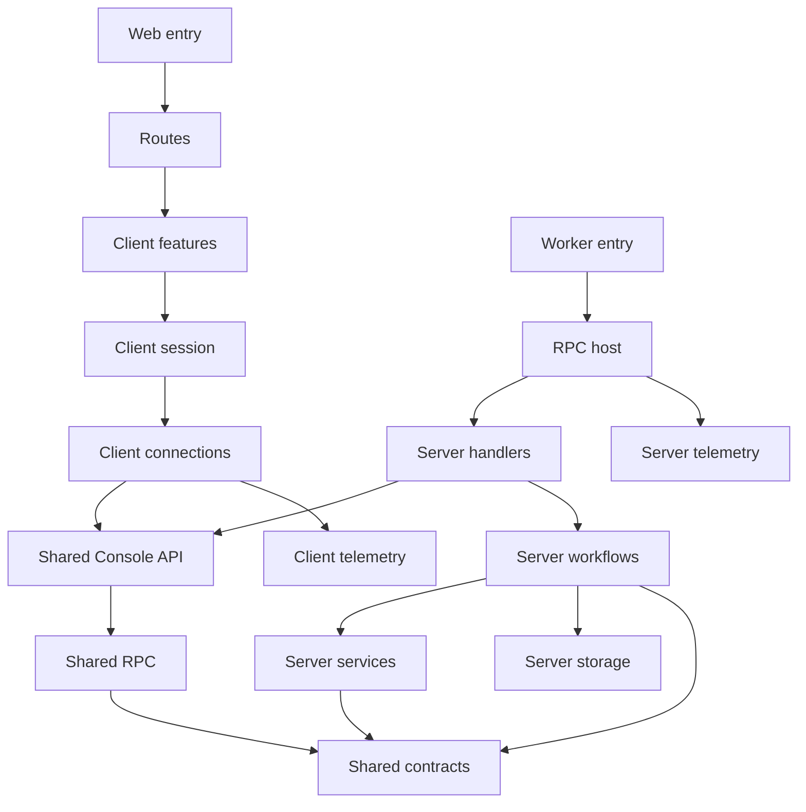

# Alchemy Console

Start with a route to follow a user interaction, or with `src/server.ts` to
follow an incoming request. The four layer graphs in `laymos.config.json`
describe the same story as the folders.

```text
src/
  router.tsx                         Starts the web router
  routes/                            Owns URLs, navigation and page composition
  client/
    features/
      auth-boundary/                 Gates the application on login and connection
      store-console/                 Client module graph
        workspace/                   Public door: management and exploration
        store-management/            Saved connections, switching and credential dialogs
        state-browser/               Stack/stage accordion, overviews and resource counts
        resource-browser/            Resource summaries and state details
        stage-outputs/               Stage outputs query and collapsible section
        stage-deletion-preview/      Analysis stream, retry state and reviewed plan
        stage-deletion/              Confirmations and deletion progress
        store-query/                 Store cache addresses and safe error presentation
        state-view/                  Consistent state presentation and navigation props
    session/rpc-session/             Owns connection lifetime and query/action hooks
    connections/
      auth/                          Connects to the authentication service
      rpc/                           Creates the typed RPC runtime
    telemetry/                       Configures browser telemetry
  shared/
    contracts/                       Defines pure inputs, views and failures
    rpc/                             Defines six capability-specific RPC groups
    api/console-api/                 Merges the groups and guards the entire API
  server.ts                          Dispatches Worker requests
  server/
    host/rpc-host/                   Supplies providers and hosts RPC
    handlers/console-handlers/       Binds the guarded API to operation implementations
    workflows/
      store-operations/              Backend module graph
        store-operations/            Public door: user-scoped access and safe failures
        store-management/            Connection persistence, discovery and safe views
        state-browser/               Separate list-stacks, list-stages and list-resources files
        resource-browser/            Validated resource summaries and state
        stage-outputs/               Validated outputs
        stage-deletion-preview/      Preview of an authorized target
        stage-deletion/              Leased execution of an authorized target
    services/
      cloudflare-discovery/          Resolves a connection through Cloudflare
      alchemy-state/                 Reads and masks remote Alchemy state
      stage-destruction/             Runs Alchemy Plan.destroy and Apply in the Worker
    storage/state-store-database/    Owns table, record evolution and entity binding
    storage/stage-deletion-lock/     Serializes console deletions across Worker instances
    telemetry/                       Configures Worker telemetry
```

## Follow a request

`/` redirects to `/stores`, the management page, which lists every saved store
and adds, renames, re-credentials or removes one. A store URL supplies `storeId`; its
`stack`, `stage` and `resource` search parameters select what the workspace
shows. Stack and stage names in the tree and ancestor breadcrumbs are links;
the current breadcrumb is a location label. Refresh and direct links preserve
the selection.

The workspace is one screen: a sidebar tree of stacks and stages (a sheet on
narrow viewports), a main pane, and a resource panel. With no stack selected the
main pane shows every stack with its stages; with a stack, its stages and
resource counts; with a stage, a resource table (name, type, status) and the
stage outputs. Selecting a resource opens its state in a side panel on wide
viewports and a bottom sheet on phones, without leaving the stage.

The signed-in session sends one of six authenticated RPCs: `ListStacks`,
`ListStages`, `ListResources`, `ListResourceSummaries`, `GetStageOutputs`, or
`GetResourceState` (each prefixed with `AlchemyStateStore.`). Each workflow
loads the current user's saved connection and makes only the requested Alchemy
state API calls. `ListResourceSummaries` lists a stage's resources and reads
each state with up to four concurrent requests, returning only name, kind, type
and status per row; unreadable or missing state yields null type and status. Creating
a store resolves and saves its connection through Cloudflare discovery;
ordinary reads reuse it without discovery or an extra verification request.

Opening a store loads stack names, and the tree eagerly loads each stack's
stages with up to four concurrent requests. The tree behaves as a single-open
accordion: clicking a stack name opens it and navigates to its overview; the
chevron only toggles expansion. With no selection, all stacks start collapsed.
A directly selected stack opens to reveal its stage. Expanded branches show
inline loading or retry feedback. The sidebar displays no numeric counts.
Opening a stage loads resource summaries and outputs; the outputs section can be
collapsed to skip that read. Resource state loads when its panel opens. Leaving
a panel cancels its active query. Remote state and outputs are masked before
returning to the client.

Rows load counts for their immediate children with up to four concurrent
requests. Counts and destination screens share TanStack Query keys, so returning
to a loaded screen renders cached data immediately and refreshes in the
background. The query cache belongs to the signed-in session, retains inactive
entries for 30 minutes, and clears when that session ends. Query cancellation
interrupts the underlying Effect. Store mutations invalidate cached reads;
deleting a connection also removes its cached details.

The root theme provider follows the system preference until the user chooses
light or dark. It persists that choice in browser local storage under
`alchemy-console-theme` and applies it before hydration.

The workspace composes the store switcher, browsing panes and deletion flow.
Routes supply link components, navigation callbacks and the account-menu slot,
so features do not know route paths or import the router. After deletion settles,
the workspace refreshes state; after successful deletion is dismissed, it moves
selection out of the deleted stage. Preview does not invalidate browsing data.

## Frontend/backend contract

`POST /rpc` (also `/rpc/`) serves the shared `ConsoleApi` over NDJSON. The client
and host import the same composed definition. `Authz.guard()` wraps the merged
group once, so every procedure inherits authentication. The operation boundary
still checks store ownership and deletion permissions. Capability declarations
are not independently mounted.

All procedure names have the `AlchemyStateStore.` prefix:

| Capability       | Procedures                                                | Response                                                                  |
| ---------------- | --------------------------------------------------------- | ------------------------------------------------------------------------- |
| Store management | `Create`, `List`, `Rename`, `UpdateCredentials`, `Delete` | Masked saved-store views, or void for removal                             |
| State browser    | `ListStacks`, `ListStages`, `ListResources`               | `{ storeName, data: string[] }`                                           |
| Resource browser | `ListResourceSummaries`, `GetResourceState`               | `{ storeName, data }` with validated summaries or nullable resource state |
| Stage outputs    | `GetStageOutputs`                                         | `{ storeName, data: JSON }`                                               |
| Deletion preview | `PreviewStageDeletion`                                    | Analysis, plan, failure and heartbeat events                              |
| Stage deletion   | `DeleteStage`                                             | Progress, complete, failed and heartbeat events                           |

There are thirteen procedures; the greeting API has been removed. Browsing
keeps stacks and stages as separate calls so branch loading and cached reads
remain independently addressable. Shared schemas own input and output shapes;
the backend decodes remote state before returning it. Store-management failures
use `StateStoreError`, read failures use `StoreDetailsError`, and deletion
failures use `DeleteStageError`, in addition to inherited authentication errors.

Preview accepts `{ storeId, stack, stage }`. Execution additionally requires
the reviewed `fingerprint`; the backend prepares the plan again before applying.
Preview ends with a plan or failure; execution ends with complete or failed.
Heartbeats are not terminal results. The client reports a stream ending without
a terminal result as an interrupted operation. Neither stream represents a
durable background job.

## Stage deletion

Deletion runs inside the console Cloudflare Worker. There is no separate Node
server, container, CLI invocation or executor secret. Node compatibility APIs
satisfy Alchemy's platform imports; no child process is started. Vite prebundles the private
`alchemy-console/stage-destruction-engine` entry in development, so the module
loader never evaluates unused public CLI/emulator exports. Restart dev when
changing this engine; forced optimization rebuilds its local source. Alchemy owns the
plan, dependency ordering, retention, provider cleanup and state updates.

The deletion member first asks for confirmation, then delegates streaming
analysis and the readable plan to the preview member. A second confirmation starts a blocking progress dialog over
NDJSON RPC. Navigation and dismissal are blocked while it runs. Completion or
failure refreshes cached state. Closing the browser or losing the connection can
interrupt the request; there is no background job or reconnect protocol.

Stages with a case-insensitive `prod` prefix are protected: anyone can preview
their deletion, but the delete request must carry the exact acknowledgement
phrase `I KNOW WHAT I AM DOING`. The dialog asks for it after the plan is shown
and the workflow rejects the request without it. Every other nonempty stage name
deletes after the plan review alone. Ownership and the presence of account
credentials are checked on the server; credentials always come from the saved
connection. There is no stored access level: every connection offers deletion.
Planning validates state only; a missing Cloudflare permission fails at apply
time on that resource, Alchemy skips its dependents, keeps the remaining state,
and the same stage can be deleted again after the token is fixed. The
token dialog offers a minimal Read template (Workers Scripts and Secrets Store,
which discovery needs) and a Write template adding KV, R2, D1, Queues, zone
reads, DNS and Workers Routes. Hyperdrive has no template key and must be added
by hand.

The native service composes stock live providers for Workers and routes, D1,
KV, R2 and its notifications/Sippy/catalog, Workflows, DNS records, Secrets Store,
Hyperdrive, queue subscriptions, Random and KeyPair. Other resource types,
including Queues and queue consumers, currently block the entire stage during
preview: those Alchemy providers still import local runtime initialization that
fails in workerd. This check includes older replacement generations. Providers
are never replaced with handwritten Cloudflare deletion calls.

Cloudflare credentials and account context are scoped to each operation through
Alchemy/Distilled services. HTTP state uses Alchemy's native HTTP store and its
separate bearer token. Extra zone ownership checks use the typed Distilled SDK.
Neither global fetch nor process environment variables are modified. Persisted
account mismatches and local-mode state block planning. Plans are fingerprinted
and rechecked immediately before applying. Progress contains only safe resource
identifiers and statuses, never raw provider payloads or errors.

A D1 lease prevents overlapping console deletions for the same state endpoint,
stack and stage across Worker instances. Execution has a 15-minute deadline and
crashed leases expire after 16 minutes. This does not lock independent Alchemy
CLI/CI deployments: do not deploy to a stage while deleting it. The HTTP state
backend offers no shared transaction spanning planning and cloud mutations.

## Dependency direction

Arrows below mean “may import,” not a network call. Network communication uses
the shared protocol; there is no client-to-server implementation import.



The shared graph owns contracts and protocols. The client and server graphs
connect their runtime layers to those shared layers. The routes graph connects
framework entry points to client features. Layer graphs are views over one
combined dependency policy: their rules are unioned and transitive.

## Isolation

Each module graph has one exposed door: client `workspace` and backend
`store-operations`. Its other members are private, reachable only through
declared, non-transitive graph edges. Every directory member has a thin
`index.ts` exporting from its same-named implementation file. Neither graph
has an index of its own, and neither crosses a layer boundary.

| Independent peers                            | Where collaboration belongs    |
| -------------------------------------------- | ------------------------------ |
| Cloudflare discovery and Alchemy state       | Server workflows               |
| Store management and remote-state operations | Backend store-operations graph |
| Store management, browsing and deletion UI   | Client workspace graph         |
| Login boundary and workspace                 | Routes                         |
| Authentication and RPC connections           | Client session                 |
| RPC handlers                                 | RPC host                       |

Services cannot import storage, workflows or handlers. Client code and routes
cannot reach server implementations. Shared contracts cannot reach either
runtime. Common lower dependencies remain allowed; independence does not mean
duplicating a shared contract or giving every workflow its own database.

The RPC provider and hooks form one session capability. Their React context
stays private inside that module. Session owns runtime/cache lifetime and
session refresh; it has no store query keys or feature-specific error codes and
does not invalidate store data after arbitrary actions. The client graph's
`store-query` member owns the cache address hierarchy and safe error copy.
Individual capabilities own their queries and mutation effects; the workspace
coordinates effects spanning several capabilities. The storage module similarly owns its table,
schema evolution and entity binding together. Its exports are used to build
the database at the host and access records in workflows.

The graph boundaries and rationale are recorded in
`docs/adr/0001-capability-module-graphs.md`. Presentation primitives in
`query-feedback` remain shared with the surrounding client-feature layer;
graph-private members cannot be imported through that shared surface.

Browser and Worker telemetry each own their small runtime configuration. Both
use the telemetry toolkit; shared application code remains pure.

## Check the structure

From the repository root:

```sh
pnpm --filter alchemy-console lint:laymos
pnpm --filter alchemy-console exec laymos inspect project
pnpm --filter alchemy-console lint:tsc
pnpm --filter alchemy-console test
pnpm --filter alchemy-console test:worker
pnpm --filter alchemy-console build
```

Laymos checks coverage, dependency direction, sibling isolation and imports
through module entry points. Generated routes are excluded from analysis;
their source route files remain covered.
