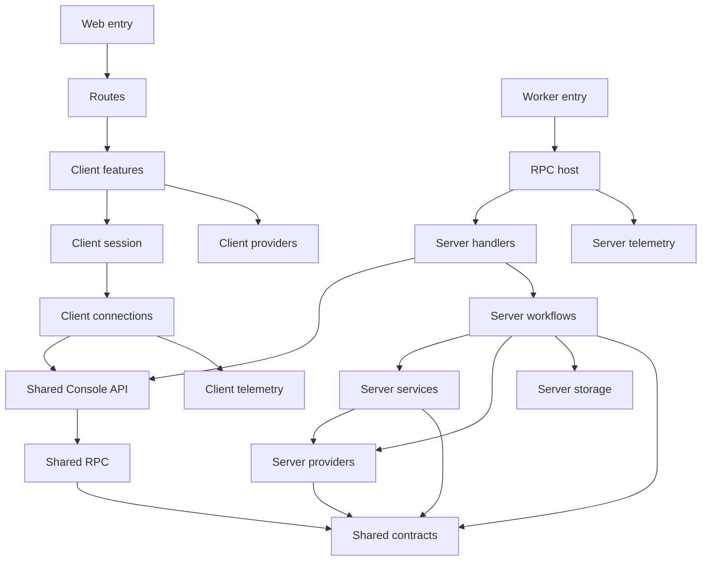

# Alchemy Console

Start with a route to follow a user interaction, or with `src/server.ts` to
follow an incoming request. The four layer graphs in `laymos.config.json`
describe the same story as the folders.

```text
src/
  router.tsx                         Starts the web router
  routes/                            Owns URLs, navigation and page composition
    settings/page.tsx                Credential settings
    stores/page.tsx                  Store list
    stores/$storeId/page.tsx         Workspace for one store
  client/
    providers/                       Client module graph: credential forms
      credential-forms/              Public door: fields, validation and account formatting by provider
      cloudflare/                    Account ID, API token and token templates
      aws/                           Access key ID and secret access key
    features/
      auth-boundary/                 Gates the application on login and connection
      credentials/                   Shared: credential queries and the add/edit/delete dialog
      settings/                      Credential settings screen, grouped by provider
      console/                       Client module graph
        workspace/                   Public door: management and exploration
        stores/                      Store list, switcher and the add/edit/delete store dialog
        explorer/                    Stack/stage tree, overviews and resource counts
        resources/                   Resource summaries and state details
        deletion/                    Review, credential selection, confirmation and progress
        queries/                     Store cache addresses
        state-view/                  Consistent state presentation and navigation props
    session/rpc-session/             Owns connection lifetime, query/action hooks and user-facing error text
    connections/
      auth/                          Connects to the authentication service
      rpc/                           Creates the typed RPC runtime
    telemetry/                       Configures browser telemetry
  shared/
    contracts/                       credentials, stores, targets, resources, deletion
    rpc/                             Credentials, Stores, Explorer and Deletion groups
    api/console-api/                 Merges the groups and guards the entire API
  server.ts                          Dispatches Worker requests
  server/
    host/rpc-host/                   Supplies providers and hosts RPC
    handlers/console-handlers/       Binds the guarded API to workflows
    workflows/
      credentials/                   Verifies, lists, updates and removes a user's credentials
      stores/                        Backend module graph
        stores/                      Public door: user-scoped access and safe failures
        access/                      Loads a store with the credentials it may use
        management/                  Store creation through discovery, listing, grants, removal
        explorer/                    Validated stacks, stages, resources, outputs and state
        deletion/                    Policy, lease and delegation to the deletion service
    services/
      alchemy-state/                 Reads and masks remote Alchemy state
      deletion/                      Server module graph
        deletion/                    Public door: preview and destroy streams
        engine/                      Runs Alchemy Plan.destroy and Apply in the Worker
        selection/                   Picks one credential per provider for the stage
        review/                      Snapshots the stage and checks every resource
        forget/                      Forget-only providers and per-resource shadows for ignored rows
    providers/                       Server module graph
      providers/                     Public door: verify, locate, check, layer, discovery by kind
      cloudflare/                    Token verification, state-store discovery, zone checks, Alchemy layer
      aws/                           STS verification, DynamoDB location and checks, Alchemy layer
    storage/
      table/                         The one console table
      stores/                        Store entity
      credentials/                   Credential entity
      deletion-lock/                 Serializes console deletions across Worker instances
    telemetry/                       Configures Worker telemetry
```

## Follow a request

`/settings` lists the user's provider credentials grouped by provider. Adding
one sends `Credentials.Create`; the workflow asks the provider to verify the
secret (a Workers-subdomain read for Cloudflare, STS for AWS), stores the
confirmed account beside it, and never returns the secret. A credential that a
store references cannot be deleted.

`/` redirects to `/stores`, which lists every store and adds, edits or removes
one. Adding a store picks the Cloudflare credential that hosts its state and
any further credentials it may delete with; `Stores.Create` runs discovery
through that credential and saves the state URL and token on the store. A
store URL supplies `storeId`; its `stack` and `stage` search parameters select
what the workspace shows.

The workspace is one screen: a sidebar tree of stacks and stages, a main pane
and a resource panel. The signed-in session sends the `Explorer.*` RPCs; each
loads the store and makes only the requested Alchemy state API calls.

Deleting a stage streams `Deletion.Preview`. The engine snapshots the stage,
selects one credential per provider (the user's choice, else the granted
credential whose account matches the recorded resources, else the store's own
credential), checks every resource with that credential, and returns a plan
carrying the selection. The review always shows the selection; changing it
re-plans. `Deletion.Delete` resends the same choices and the fingerprint.

Opening a store loads stack names, and the tree eagerly loads each stack's
stages with up to four concurrent requests. The tree behaves as a single-open
accordion: clicking a stack name opens it and navigates to its overview; the
chevron only toggles expansion. With no selection, all stacks start collapsed.
A directly selected stack opens to reveal its stage. Expanded branches show
inline loading or retry feedback. The sidebar displays no numeric counts.
Opening a stage loads resource summaries and outputs; the outputs section can be
collapsed to skip that read. Resource state loads when its panel opens. Leaving
a panel cancels its active query. Remote state and outputs are masked before
returning to the client.

Rows load counts for their immediate children with up to four concurrent
requests. Counts and destination screens share TanStack Query keys, so returning
to a loaded screen renders cached data immediately and refreshes in the
background. The query cache belongs to the signed-in session, retains inactive
entries for 30 minutes, and clears when that session ends. Query cancellation
interrupts the underlying Effect. Store mutations invalidate cached reads;
deleting a connection also removes its cached details.

The root theme provider follows the system preference until the user chooses
light or dark. It persists that choice in browser local storage under
`alchemy-console-theme` and applies it before hydration.

The workspace composes the store switcher, browsing panes and deletion flow.
Routes supply link components, navigation callbacks and the account-menu slot,
so features do not know route paths or import the router. After deletion settles,
the workspace refreshes state; after successful deletion is dismissed, it moves
selection out of the deleted stage. Preview does not invalidate browsing data.

## Frontend/backend contract

`POST /rpc` (also `/rpc/`) serves the shared `ConsoleApi` over NDJSON. The client
and host import the same composed definition. `Authz.guard()` wraps the merged
group once, so every procedure inherits authentication. The operation boundary
still checks store ownership and deletion permissions. Capability declarations
are not independently mounted.

Procedures are grouped by capability:

| Group         | Procedures                                                                      | Response                                                                |
| ------------- | ------------------------------------------------------------------------------- | ----------------------------------------------------------------------- |
| `Credentials` | `Create`, `List`, `Update`, `Delete`                                            | Credential views (name, provider, account), never a secret              |
| `Stores`      | `Create`, `List`, `Update`, `Delete`, `DeleteStack`                             | Store views (state credential and grants), or void for removal          |
| `Explorer`    | `ListStacks`, `ListStages`, `ListResources`, `GetStageView`, `GetResourceState` | `{ storeName, data }` with validated names, summaries or resource state |
| `Deletion`    | `Preview`, `Delete`                                                             | Analysis, plan, progress, complete, failed and heartbeat events         |

Shared schemas own input and output shapes; the backend decodes remote state
before returning it. Credential failures use `CredentialError`, store failures
`StoreError`, read failures `BrowseError`, and deletion failures
`DeletionError`, in addition to inherited authentication errors.

Preview accepts `{ storeId, stack, stage }` plus optional `forget` and
`credentials` choices. Execution additionally requires the reviewed
`fingerprint`; the backend prepares the plan again before applying.
Preview ends with a plan or failure; execution ends with complete or failed.
Heartbeats are not terminal results. The client reports a stream ending without
a terminal result as an interrupted operation. Neither stream represents a
durable background job.

## Stage deletion

Deletion runs inside the console Cloudflare Worker. There is no separate Node
server, container, CLI invocation or executor secret. Node compatibility APIs
satisfy Alchemy's platform imports; no child process is started. Vite prebundles the private
`alchemy-console/deletion-engine` and `alchemy-console/providers` entries
together in development, so the module loader never evaluates unused public
CLI/emulator exports (the Cloudflare Worker module resolves a workerd binary at
import). Restart dev when changing the engine, review or providers; forced
optimization rebuilds their local source. Alchemy owns the
plan, dependency ordering, retention, provider cleanup and state updates.

The deletion member first asks for confirmation, then delegates streaming
analysis and the readable plan to the preview member. A second confirmation starts a blocking progress dialog over
NDJSON RPC. Navigation and dismissal are blocked while it runs. Completion or
failure refreshes cached state. Closing the browser or losing the connection can
interrupt the request; there is no background job or reconnect protocol.

Stages with a case-insensitive `prod` prefix are protected: anyone can preview
their deletion, but the delete request must carry the exact acknowledgement
phrase `I KNOW WHAT I AM DOING`. The dialog asks for it after the plan is shown
and the workflow rejects the request without it. Every other nonempty stage name
deletes after the plan review alone. Ownership is checked on the server, and
the credentials always come from the store's saved state credential and grants.
Planning checks state and cloud identity; a missing Cloudflare deletion
permission fails at apply time on that resource, Alchemy skips its dependents,
keeps the remaining state, and the same stage can be deleted again after the
token is fixed. The Cloudflare credential form offers a minimal Read template
(Workers Scripts and Secrets Store, which discovery needs) and a Write template
adding KV, R2, D1, Queues, zone reads, DNS and Workers Routes. Hyperdrive has
no template key and must be added by hand.

The native service composes stock live providers for Workers and routes, D1,
KV, R2 and its notifications/Sippy/catalog, Workflows, DNS records, Secrets Store,
Hyperdrive, queue subscriptions, Random, KeyPair and AWS DynamoDB tables. Other resource types,
including Queues and queue consumers, currently block the entire stage during
preview: those Alchemy providers still import local runtime initialization that
fails in workerd. This check includes older replacement generations. Providers
are never replaced with handwritten Cloudflare deletion calls.

The `deletion` service is a Laymos module graph. Its exposed member owns
streaming and deadlines; `engine` snapshots the stage, asks `selection` for one
credential per provider, builds the Alchemy provider layer from that selection,
and runs native Plan/Apply. `review` inventories all resources and replacement
generations, collecting blockers instead of stopping at the first one, and
asks the provider registry to check each row with its selected credential. The
`forget` member builds no-op providers for ignored unsupported types and, for
ignored rows of supported types, shadows the real provider so only those rows
skip their cloud call.

Provider knowledge lives in the `providers` graph: `cloudflare` and `aws` each
verify a secret and report its account, locate a recorded resource's account
and region, check a row, and build the Alchemy layer. The registry door
dispatches by kind, so the deletion service never names a provider. The client
mirrors this with `credential-forms`: each provider declares its fields and how
they become a secret.

Credentials are user-owned and shared across stores. A store references the
Cloudflare credential that hosts its state plus any granted credentials. AWS
credentials carry no region; Alchemy provides one credential and one region
per Apply, so deletion selects one credential per provider for the whole stage
and derives the AWS region from the recorded table ARNs unless the user picks
one. The selection is part of the plan and of its fingerprint.

The review distinguishes unsupported types, resources whose provider has no
selected credential or region, and resources blocked by identity or
permissions.
Any blocker disables confirmation and prevents native planning/apply on the
server. The only override is per resource: any non-ready row can be ignored
with a checkbox in the review, behind a warning that whatever it created stays
behind as an orphan. The confirm request carries those choices, the server
re-runs the review treating ignored rows as ready, and the engine makes
Alchemy's native delete drop their state rows without calling any cloud API:
a forget-only provider for unsupported types, and a shadow over the real
provider that skips only the ignored resources' deletes for supported types.
The fingerprint still binds the request to the reviewed state. Executable plans come from
Alchemy's native Plan.destroy; a blocked review is an inventory, not an
executable Alchemy plan.

AWS calls use explicitly scoped Distilled credentials and region. STS verifies
the account, and DescribeTable checks the persisted ARN/name/table ID before
the native provider deletes by name. Region/account mismatches, missing table
identity, and deletion protection block deletion. A retained table may keep
deletion protection enabled. A reviewed fingerprint includes the selected
credential identities and region so changing either requires a fresh review. No local AWS
profile or emulator is initialized.

AWS permissions include DescribeTable, DeleteTable, DescribeContributorInsights
and CloudWatch DescribeInsightRules. Depending on the table configuration, the
native lifecycle may also require UpdateContributorInsights and UpdateTable.
Alchemy waits for ResourceNotFoundException before removing table state.

Cloudflare credentials and account context are scoped to each operation through
Alchemy/Distilled services. HTTP state uses Alchemy's native HTTP store and its
separate bearer token. Extra zone ownership checks use the typed Distilled SDK.
Neither global fetch nor process environment variables are modified. Persisted
account mismatches and local-mode state block planning. Plans are fingerprinted
and rechecked immediately before applying. Progress contains only safe resource
identifiers and statuses, never raw provider payloads or errors.

A D1 lease prevents overlapping console deletions for the same state endpoint,
stack and stage across Worker instances. Execution has a 15-minute deadline and
crashed leases expire after 16 minutes. This does not lock independent Alchemy
CLI/CI deployments: do not deploy to a stage while deleting it. The HTTP state
backend offers no shared transaction spanning planning and cloud mutations.

## Dependency direction

Arrows below mean “may import,” not a network call. Network communication uses
the shared protocol; there is no client-to-server implementation import.



The shared graph owns contracts and protocols. The client and server graphs
connect their runtime layers to those shared layers. The routes graph connects
framework entry points to client features. Layer graphs are views over one
combined dependency policy: their rules are unioned and transitive.

## Isolation

Each module graph has one exposed door: client `workspace` and
`credential-forms`, backend `stores`, `deletion` and `providers`. Its other members are private, reachable only through
declared, non-transitive graph edges. Every directory member has a thin
`index.ts` exporting from its same-named implementation file. Neither graph
has an index of its own, and neither crosses a layer boundary.

| Independent peers                            | Where collaboration belongs |
| -------------------------------------------- | --------------------------- |
| Cloudflare and AWS providers                 | Providers registry          |
| Credentials and stores                       | Server workflows            |
| Store management and remote-state operations | Backend stores graph        |
| Store management, browsing and deletion UI   | Client console graph        |
| Login boundary and workspace                 | Routes                      |
| Authentication and RPC connections           | Client session              |
| RPC handlers                                 | RPC host                    |

Services cannot import storage, workflows or handlers. Client code and routes
cannot reach server implementations. Shared contracts cannot reach either
runtime. Common lower dependencies remain allowed; independence does not mean
duplicating a shared contract or giving every workflow its own database.

The RPC provider and hooks form one session capability. Their React context
stays private inside that module. Session owns runtime/cache lifetime and
session refresh and turns RPC failures into user-facing text; it has no store
query keys and does not invalidate store data after arbitrary actions. The
client graph's `queries` member owns the cache address hierarchy.
Individual capabilities own their queries and mutation effects; the workspace
coordinates effects spanning several capabilities. The storage module similarly owns its table,
schema evolution and entity binding together. Its exports are used to build
the database at the host and access records in workflows.

The graph boundaries and rationale are recorded in
`docs/adr/0001-capability-module-graphs.md`; user-owned credentials and
per-deletion selection in
`docs/adr/0002-user-owned-credentials-selected-per-deletion.md`. Presentation primitives in
`query-feedback` remain shared with the surrounding client-feature layer;
graph-private members cannot be imported through that shared surface.

Browser and Worker telemetry each own their small runtime configuration. Both
use the telemetry toolkit; shared application code remains pure.

## Check the structure

From the repository root:

```sh
pnpm --filter alchemy-console lint:laymos
pnpm --filter alchemy-console exec laymos inspect project
pnpm --filter alchemy-console lint:tsc
pnpm --filter alchemy-console test
pnpm --filter alchemy-console test:worker
pnpm --filter alchemy-console build
```

Laymos checks coverage, dependency direction, sibling isolation and imports
through module entry points. Generated routes are excluded from analysis;
their source route files remain covered.
