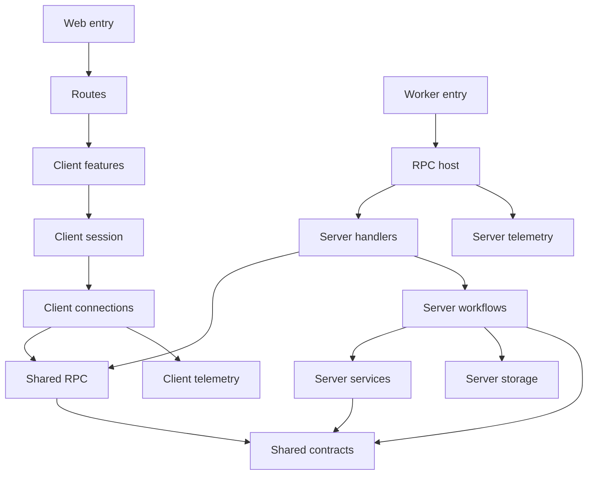

# Alchemy Console

Start with a route to follow a user interaction, or with `src/server.ts` to
follow an incoming request. The four layer graphs in `laymos.config.json`
describe the same story as the folders.

```text
src/
  router.tsx                         Starts the web router
  routes/                            Owns URLs, navigation and page composition
  client/
    features/
      auth-boundary/                 Gates the application on login and connection
      store-list/                    Lists, creates, renames and removes stores
      store-explorer/                Explores stacks, stages and resource state
      delete-stage/                  Owns confirmations, readable plans and progress
    session/rpc-session/             Owns connection lifetime and query/action hooks
    connections/
      auth/                          Connects to the authentication service
      rpc/                           Creates the typed RPC runtime
    telemetry/                       Configures browser telemetry
  shared/
    contracts/                       Defines pure inputs, views and failures
    rpc/                             Defines authenticated RPC protocols
  server.ts                          Dispatches Worker requests
  server/
    host/rpc-host/                   Supplies providers and hosts RPC
    handlers/                        Connects protocols to workflows
    workflows/
      state-stores/                  Manages user-owned connections and safe views
      store-details/                 Loads an owned connection and reads
                                     only the requested level
    services/
      cloudflare-discovery/          Resolves a connection through Cloudflare
      alchemy-state/                 Reads and masks remote Alchemy state
      stage-destruction/             Runs Alchemy Plan.destroy and Apply in the Worker
    storage/state-store-database/    Owns table, record evolution and entity binding
    storage/stage-deletion-lock/     Serializes console deletions across Worker instances
    telemetry/                       Configures Worker telemetry
```

## Follow a request

A store URL supplies `storeId`; its `stack` and `stage` search parameters select
one level of the explorer. Breadcrumb links update those parameters, preserving
browser Back, refresh, and direct links. Resource selection opens a dialog and
does not add a navigation level.

The signed-in session sends one of five authenticated RPCs: `ListStacks`,
`ListStages`, `ListResources`, `GetStageOutputs`, or `GetResourceState` (each
prefixed with `AlchemyStateStore.`). Each workflow loads the current user's
saved connection and makes only the requested Alchemy state API call. Creating
a store resolves and saves its connection through Cloudflare discovery;
ordinary reads reuse it without discovery or an extra verification request.

Opening a store loads stack names. Opening a stack loads stage names. Opening
a stage loads resource identifiers. Outputs load when their tab opens, and
resource state loads when its dialog opens. Closing a dialog cancels its active
query. Remote state and outputs are masked before returning to the client.

Rows load counts for their immediate children with up to four concurrent
requests. Counts and destination screens share TanStack Query keys, so returning
to a loaded screen renders cached data immediately and refreshes in the
background. The query cache belongs to the signed-in session, retains inactive
entries for 30 minutes, and clears when that session ends. Query cancellation
interrupts the underlying Effect. Store mutations invalidate cached reads;
deleting a connection also removes its cached details.

The root theme provider follows the system preference until the user chooses
light or dark. It persists that choice in browser local storage under
`alchemy-console-theme` and applies it before hydration.

The explorer owns search, tabs, dialogs, and rendering. Routes supply link
components, so features do not know route paths or import the router.

## Stage deletion

Deletion runs inside the console Cloudflare Worker. There is no separate Node
server, container, CLI invocation or executor secret. Node compatibility APIs
satisfy Alchemy's platform imports; no child process is started. Vite prebundles the private
`alchemy-console/stage-destruction-engine` entry in development, so the module
loader never evaluates unused public CLI/emulator exports. Restart dev when
changing this engine; forced optimization rebuilds its local source. Alchemy owns the
plan, dependency ordering, retention, provider cleanup and state updates.

The independent deletion feature first asks for confirmation, then loads a
readable plan. A second confirmation starts a blocking progress dialog over
NDJSON RPC. Navigation and dismissal are blocked while it runs. Completion or
failure refreshes cached state. Closing the browser or losing the connection can
interrupt the request; there is no background job or reconnect protocol.

Both the workflow and service reject case-insensitive `prod` prefixes. Every
other nonempty stage name is eligible. Ownership and saved admin access are
checked on the server; credentials always come from the saved connection. Old
connections default to view access. The token dialog offers the existing view
template and a broad admin template, editable in Cloudflare. Console view access
is an application restriction: discovery still requires some Cloudflare Edit
permissions. Token templates cannot guarantee permission for every product.

The native service composes stock live providers for Workers and routes, D1,
KV, R2 and its notifications/Sippy/catalog, Workflows, DNS records, Secrets Store,
Hyperdrive, queue subscriptions, Random and KeyPair. Other resource types,
including Queues and queue consumers, currently block the entire stage during
preview: those Alchemy providers still import local runtime initialization that
fails in workerd. This check includes older replacement generations. Providers
are never replaced with handwritten Cloudflare deletion calls.

Cloudflare credentials and account context are scoped to each operation through
Alchemy/Distilled services. HTTP state uses Alchemy's native HTTP store and its
separate bearer token. Extra zone ownership checks use the typed Distilled SDK.
Neither global fetch nor process environment variables are modified. Persisted
account mismatches and local-mode state block planning. Plans are fingerprinted
and rechecked immediately before applying. Progress contains only safe resource
identifiers and statuses, never raw provider payloads or errors.

A D1 lease prevents overlapping console deletions for the same state endpoint,
stack and stage across Worker instances. Execution has a 15-minute deadline and
crashed leases expire after 16 minutes. This does not lock independent Alchemy
CLI/CI deployments: do not deploy to a stage while deleting it. The HTTP state
backend offers no shared transaction spanning planning and cloud mutations.

## Dependency direction

Arrows below mean “may import,” not a network call. Network communication uses
the shared protocol; there is no client-to-server implementation import.



The shared graph owns contracts and protocols. The client and server graphs
connect their runtime layers to those shared layers. The routes graph connects
framework entry points to client features. Layer graphs are views over one
combined dependency policy: their rules are unioned and transitive.

## Isolation

Every module explicitly sets `shared: false`. Exposed modules can be consumed
through `index.ts` from permitted higher layers, but ordinary peers in the same
layer cannot import them.

| Independent peers                                  | Where collaboration belongs                      |
| -------------------------------------------------- | ------------------------------------------------ |
| Cloudflare discovery and Alchemy state             | Server workflows                                 |
| State-store management and store-details workflows | Handlers or a broader workflow in a higher layer |
| Login boundary, store list and explorer            | Routes                                           |
| Authentication and RPC connections                 | Client session                                   |
| RPC handlers                                       | RPC host                                         |

Services cannot import storage, workflows or handlers. Client code and routes
cannot reach server implementations. Shared contracts cannot reach either
runtime. Common lower dependencies remain allowed; independence does not mean
duplicating a shared contract or giving every workflow its own database.

The RPC provider and hooks form one session capability. Their React context
stays private inside that module. The storage module similarly owns its table,
schema evolution and entity binding together. Its exports are used to build
the database at the host and access records in workflows.

No module graph is needed for the current capabilities. Private helper files
stay inside their owner. If a capability develops independently useful internal
modules with meaningful dependency directions, give that capability a module
graph with explicit edges; do not put unrelated peer services into one graph.

Browser and Worker telemetry each own their small runtime configuration. Both
use the telemetry toolkit; shared application code remains pure.

## Check the structure

From the repository root:

```sh
pnpm --filter alchemy-console lint:laymos
pnpm --filter alchemy-console exec laymos inspect project
pnpm --filter alchemy-console lint:tsc
pnpm --filter alchemy-console test
pnpm --filter alchemy-console test:worker
pnpm --filter alchemy-console build
```

Laymos checks coverage, dependency direction, sibling isolation and imports
through module entry points. Generated routes are excluded from analysis;
their source route files remain covered.
