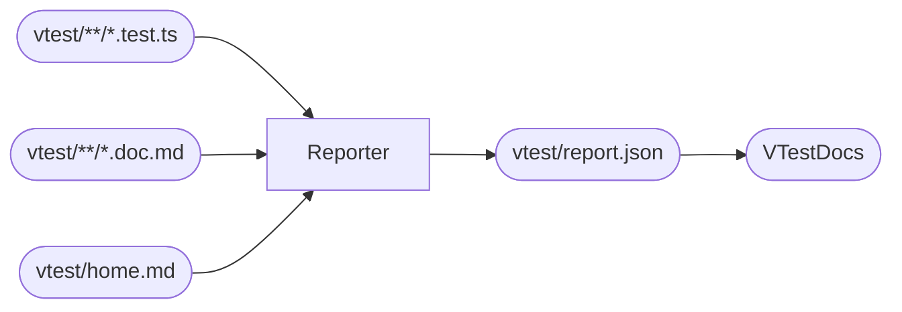

# @monorepo/frontend

Live documentation for the frontend's utility surface, generated from the
test suite by `@monorepo/vtest`. **Every code sample on every page is a real
test that just ran** — if the page renders, the assertion held.

## How docs work

| Source                 | Becomes                                    |
| ---------------------- | ------------------------------------------ |
| `vtest/home.md`        | this overview page                         |
| `<dir>/index.doc.md`   | the folder/section page                    |
| `<dir>/<name>.doc.md`  | the module page header                     |
| `vdescribe(name, doc)` | a suite row — click for the suite dialog   |
| `vtest(name, doc, fn)` | a row inside the suite dialog with snippet |

## Modules

- **strings** — case conversion, slug generation
- **numbers** — clamping, linear interpolation
- **arrays** — chunking, deduplication
- **parser** — a tiny tokenizer used to stress-test snippet extraction

> Every test below is green; intentionally broken / pending / skipped
> examples live in the playground fixture, not here.
