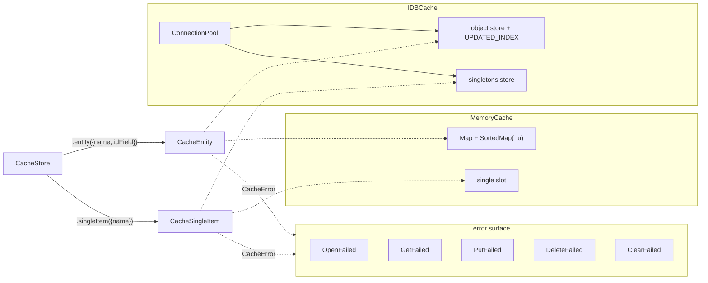

# @std-toolkit/cache

An **Effect-native cache** for `@std-toolkit/core` entities. The package
defines three small interfaces — `CacheStore`, `CacheEntity<T>`,
`CacheSingleItem<T>` — and ships two concrete backends: an in-process
`MemoryCache` and a browser-side `IDBCache` built on IndexedDB. Every
operation is an `Effect.Effect<A, CacheError>`, so caching composes with
the rest of an Effect pipeline (retry, timeout, tracing) without bespoke
glue.

The cache is **entity-shaped**, not blob-shaped. Values are
`EntityType<T>` / `SingleEntityType<T>` from `@std-toolkit/core`: a `value`
payload plus a `meta` block carrying entity tag (`_e`), schema version
(`_v`), an update marker (`_u`) and a soft-delete flag (`_d`). The `_u`
field is the only sort key the cache understands; it is what
`getLatest()` / `getOldest()` consult, and what keeps the IDB index in
order.

## Architecture



## Install

```bash
pnpm add @std-toolkit/cache effect
```

The `IDBCache` backend requires a browser (or `fake-indexeddb` in tests).
The `MemoryCache` backend has no runtime dependencies.

## Quick start

```ts
import { Effect } from 'effect';
import { MemoryCache } from '@std-toolkit/cache/memory';

type User = { id: string; name: string };

const program = Effect.gen(function* () {
  const cache = new MemoryCache();
  const users = yield* cache.entity<User>({ name: 'User', idField: 'id' });

  yield* users.put({
    value: { id: 'u1', name: 'Alice' },
    meta: { _e: 'User', _v: 'v1', _u: 'uid-001', _d: false },
  });

  const latest = yield* users.getLatest();
  // Option.some({ value: { id: 'u1', name: 'Alice' }, meta: { ... } })
});

Effect.runPromise(program);
```

## Backends

| Backend       | Module                      | Persistence | Use when                            |
| ------------- | --------------------------- | ----------- | ----------------------------------- |
| `MemoryCache` | `@std-toolkit/cache/memory` | none        | tests, ephemeral state, server-side |
| `IDBCache`    | `@std-toolkit/cache/idb`    | IndexedDB   | browser caching across reloads      |

Both implement the same `CacheStore` interface; swap the constructor and
nothing else has to change.

## Modules

- [errors](./errors/index.doc.md) — `CacheError` tagged-error variants
- [partition](./partition/index.doc.md) — `serializePartition` key helper
- [memory](./memory/index.doc.md) — `MemoryCache`, `MemoryCacheEntity`, `MemoryCacheSingleItem`
- [idb](./idb/index.doc.md) — `IDBCache`, `IDBCacheEntity`, `IDBCacheSingleItem`

## Why another cache?

- **Entity-shaped, not blob-shaped.** Values carry a `meta` block, so the
  cache knows about schema version (`_v`) and update marker (`_u`)
  without having to call back into user code.
- **`getLatest()` / `getOldest()` are first-class.** Both backends keep
  a `_u`-ordered index so recency queries are O(log n), not O(n).
- **One error type for the whole surface.** Every fallible operation
  returns `Effect.Effect<A, CacheError>`, and `CacheError.error._tag`
  is a closed union — `Effect.catchTag('CacheError', …)` covers
  everything.
- **Backend-agnostic at the call site.** `CacheStore` is the only
  interface the application code needs; the choice between in-memory
  and IndexedDB is a single line at construction.
