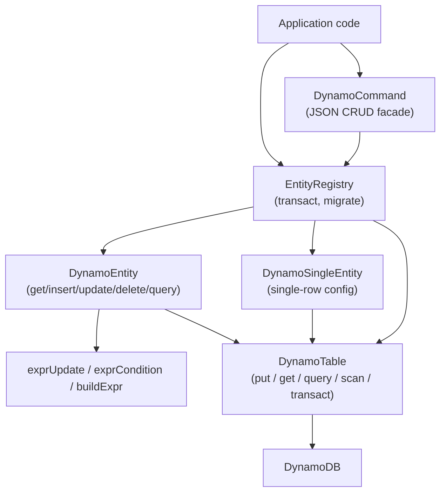

# @std-toolkit/db-dynamodb

A type-safe DynamoDB abstraction built on Effect. The package layers a thin
`DynamoTable` wrapper underneath a schema-driven `DynamoEntity` /
`DynamoSingleEntity` runtime, and unifies multiple entities behind an
`EntityRegistry` that owns cross-entity transactions and table-wide schema
migration.

The documentation here is **operation-centric**. The table-level API is a
deliberately small substrate — the interesting behaviour (key derivation,
optimistic locking, broadcast, schema evolution, migration scan) all lives
at the entity / single-entity / registry layer, and is documented
operation-by-operation in the folders below.

## Architecture



## Install

```bash
pnpm add @std-toolkit/db-dynamodb effect @std-toolkit/eschema
```

## Quick start

```ts
import {
  DynamoTable,
  DynamoEntity,
  EntityRegistry,
} from '@std-toolkit/db-dynamodb';
import { EntityESchema } from '@std-toolkit/eschema';
import { Schema } from 'effect';

const table = DynamoTable.make({
  tableName: 't',
  region: 'us-east-1',
  credentials: { accessKeyId: '...', secretAccessKey: '...' },
})
  .primary('pk', 'sk')
  .gsi('GSI1', 'GSI1PK', 'GSI1SK')
  .build();

const user = EntityESchema.make('User', 'id', {
  email: Schema.String,
  name: Schema.String,
}).build();

const UserEntity = DynamoEntity.make(table)
  .eschema(user)
  .primary({ pk: ['id'] })
  .index('GSI1', 'byEmail', { pk: ['email'] })
  .build();

const registry = EntityRegistry.make(table).register(UserEntity).build();
```

## Modules

- [entity](./entity/index.doc.md) — `DynamoEntity` operations: get, insert, update, delete, query (+ secondary indexes), batch-insert, transactions, schema evolution, migration, broadcast
- [single-entity](./single-entity/index.doc.md) — `DynamoSingleEntity` operations: get, put, update
- [registry](./registry/index.doc.md) — `EntityRegistry` operations: register, transact, migrate
- [command](./command/index.doc.md) — `DynamoCommand` JSON facade: insert, update, delete, query, descriptor

## Why another DynamoDB wrapper?

- **Schemas are evolvable, not frozen.** Adding a field is a one-line
  `.evolve()` step; old rows decode into the current shape on read, and an
  opt-in registry scan rewrites them lazily.
- **Keys are _derived_, not stored manually.** You declare which entity
  fields contribute to each index; the library writes (and refreshes) the
  pk/sk columns on every put.
- **Transactions broadcast.** A successful `registry.transact([...])`
  emits the resulting entities through `ConnectionService` so downstream
  subscribers stay coherent with the row that just landed.
- **Migration is explicit.** Drift between stored rows and the current
  entity definition is surfaced as a typed inspection
  (`stale | corrupt | primaryKeyChanged | ignored`), with dry-run by
  default.
