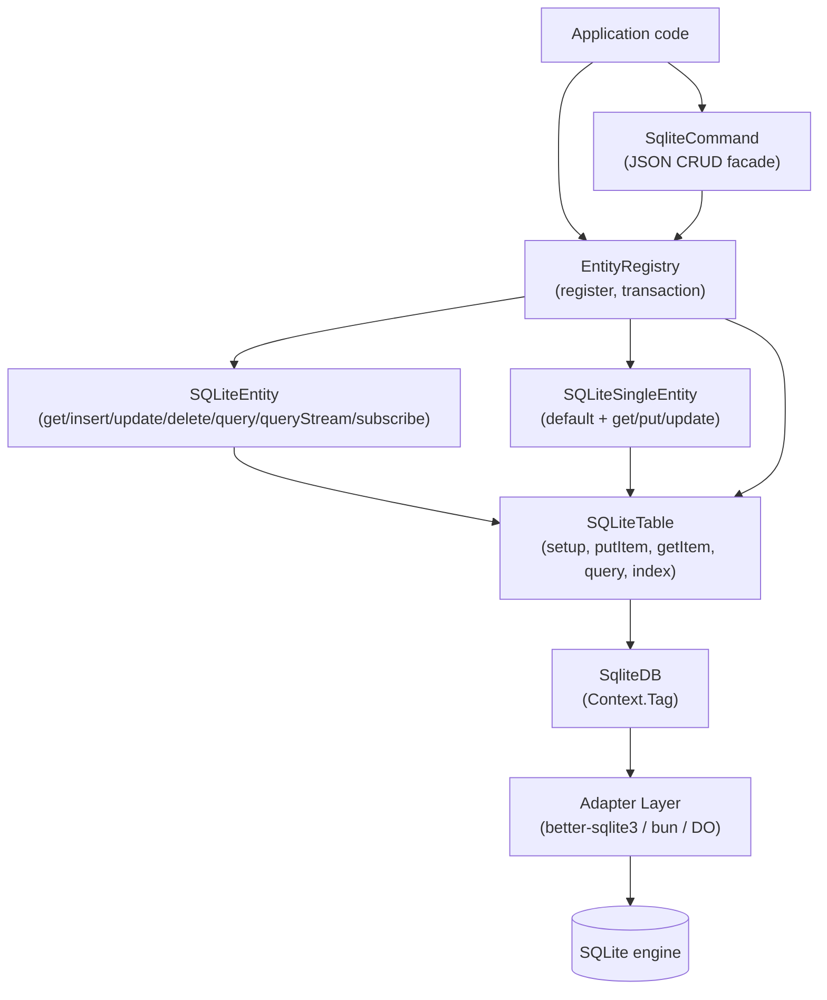

# @std-toolkit/sqlite

A type-safe SQLite abstraction built on Effect. The package layers a thin
`SQLiteTable` wrapper underneath a schema-driven `SQLiteEntity` /
`SQLiteSingleEntity` runtime, and unifies multiple entities behind an
`EntityRegistry` that owns the shared table and cross-entity transactions.

The documentation here is **operation-centric**. The table-level API is a
deliberately small substrate — the interesting behaviour (key derivation,
soft delete, broadcast, paginated streaming, registry transactions) all
lives at the entity / single-entity / registry layer, and is documented
operation-by-operation in the folders below.

The package mirrors `@std-toolkit/db-dynamodb` on purpose: the entity API
surface, schema contract, and key-derivation rules are identical, so you
can target one in production and the other in local / browser / embedded
contexts (Bun, better-sqlite3, Durable Objects) with no application
changes.

## Architecture



## Install

```bash
pnpm add @std-toolkit/sqlite effect @std-toolkit/eschema
```

Pick an adapter for your environment:

```ts
import { SqliteDBBetterSqlite3 } from '@std-toolkit/sqlite/adapters/better-sqlite3';
import { SqliteDBBun } from '@std-toolkit/sqlite/adapters/bun';
import { SqliteDBDurableObject } from '@std-toolkit/sqlite/adapters/do';
```

## Quick start

```ts
import { SQLiteTable, SQLiteEntity, EntityRegistry } from '@std-toolkit/sqlite';
import { SqliteDBBetterSqlite3 } from '@std-toolkit/sqlite/adapters/better-sqlite3';
import { EntityESchema } from '@std-toolkit/eschema';
import { Effect, Schema } from 'effect';
import Database from 'better-sqlite3';

const table = SQLiteTable.make({ tableName: 'std_data' })
  .primary('pk', 'sk')
  .index('IDX1', 'IDX1PK', 'IDX1SK')
  .build();

const user = EntityESchema.make('User', 'userId', {
  email: Schema.String,
  name: Schema.String,
}).build();

const UserEntity = SQLiteEntity.make(table)
  .eschema(user)
  .primary()
  .index('IDX1', 'byEmail', { pk: ['email'] })
  .build();

const registry = EntityRegistry.make(table).register(UserEntity).build();

const db = new Database(':memory:');
const layer = SqliteDBBetterSqlite3(db);

await Effect.runPromise(registry.setup().pipe(Effect.provide(layer)));
```

## Modules

- [table](./table/index.doc.md) — `SQLiteTable` substrate: single-table
  layout, `setup`, primary/secondary index columns, raw item ops
- [entity](./entity/index.doc.md) — `SQLiteEntity` operations: get,
  insert, update, delete, query, queryStream, subscribe, secondary
  indexes, broadcast
- [single-entity](./single-entity/index.doc.md) — `SQLiteSingleEntity`
  operations: get (with default), put, update
- [registry](./registry/index.doc.md) — `EntityRegistry` operations:
  register, transaction
- [command](./command/index.doc.md) — `SqliteCommand` JSON facade:
  insert, update, delete, query, descriptor (+ RPC handler)

## Why another SQLite wrapper?

- **Single-table design, ported.** One row layout (`pk`, `sk`, `_data`,
  `_e`, `_v`, `_u`, `_d` plus secondary index columns) for every entity.
  You add an entity by declaring a schema, not by running a migration.
- **Keys are _derived_, not stored manually.** You declare which entity
  fields contribute to each index; the library writes (and refreshes) the
  pk/sk columns on every put.
- **Soft delete by default.** `entity.delete(...)` updates `_d = 1` plus
  a new `_u` so sync consumers can observe the tombstone — hard delete
  is reserved for `dangerouslyRemoveAllRows`.
- **Transactions broadcast on commit.** Writes made inside
  `registry.transaction(effect)` collect broadcasts in a `FiberRef`; the
  flushed batch only fires once the SQLite `COMMIT` succeeds.
- **Adapter-agnostic.** The same entity code runs on `better-sqlite3`
  (Node), `bun:sqlite` (Bun), or Cloudflare Durable Object SQL — only
  the `SqliteDB` layer changes.
