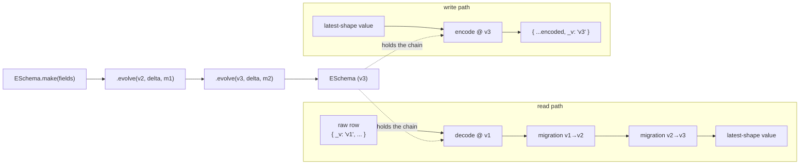

# @std-toolkit/eschema

An **evolving schema** is a versioned schema definition where every encoded
value is tagged with the schema version (`_v`) at which it was written, and
the schema itself carries an ordered chain of migrations from `v1` up to the
current latest version. Reading old data is a one-call operation: the schema
decodes the row against the version stamp, then folds the row forward
through every subsequent migration until it matches the latest shape. The
caller never sees a version older than `latest`, and the storage layer is
free to lazily rewrite rows on the next write.

This package is a thin, type-driven wrapper over
[Effect Schema](https://effect.website/docs/schema/introduction) that
exposes that flow as `make → evolve → build → encode/decode`, with three
flavors (`ESchema`, `SingleEntityESchema`, `EntityESchema`) that differ only
in identity (anonymous, named, named + id field). It implements
[Standard Schema v1](https://github.com/standard-schema/standard-schema) so
the result drops into any form library or validator that speaks the spec.

## Architecture



## Install

```bash
pnpm add @std-toolkit/eschema effect
```

## Quick start

```ts
import { Effect, Schema } from 'effect';
import { ESchema } from '@std-toolkit/eschema';

const User = ESchema.make({ name: Schema.String })
  .evolve('v2', { email: Schema.String }, (prev) => ({
    ...prev,
    email: 'unknown@example.com',
  }))
  .build();

const latest = Effect.runSync(User.decode({ _v: 'v1', name: 'Bob' }));
// { name: 'Bob', email: 'unknown@example.com' }
```

## Variants

| Variant               | Adds                        | Use when                                          |
| --------------------- | --------------------------- | ------------------------------------------------- |
| `ESchema`             | nothing                     | Anonymous payload (config blobs, message bodies)  |
| `SingleEntityESchema` | `name`                      | Named singleton (e.g. `Settings`, `FeatureFlags`) |
| `EntityESchema`       | `name` + reserved `idField` | Rows in a keyed store (DynamoDB, Postgres, KV)    |

## Modules

- [make](./make/index.doc.md) — create an `ESchema` / `SingleEntityESchema` / `EntityESchema` builder
- [evolve](./evolve/index.doc.md) — add a new version with a delta and migration
- [encode](./encode/index.doc.md) — produce a wire value stamped with the latest `_v`
- [decode](./decode/index.doc.md) — accept any past version and fold forward to the latest shape
- [interop](./interop/index.doc.md) — `toSchema`, `getDescriptor`, Standard Schema v1
- [errors](./errors/index.doc.md) — `ESchemaError` shape and when each variant fires

## Why another schema library?

- **Schemas are evolvable, not frozen.** Adding a field is a one-line
  `.evolve()` step. Old rows decode into the current shape on read; no
  separate "migration" job needs to touch the data first.
- **Migrations are typed end-to-end.** The `prev → next` function is
  parameterised by the previous version's decoded shape, so a missing
  field at v2 is a TypeScript error, not a runtime surprise.
- **Reserved fields are enforced at the type level.** Keys starting with
  `_` are rejected at `make`/`evolve`, and on `EntityESchema` the `idField`
  is reserved so the library's metadata never collides with user fields.
- **Standard Schema v1 out of the box.** The built schema exposes
  `~standard.validate` so it drops into any compatible form / validator.
